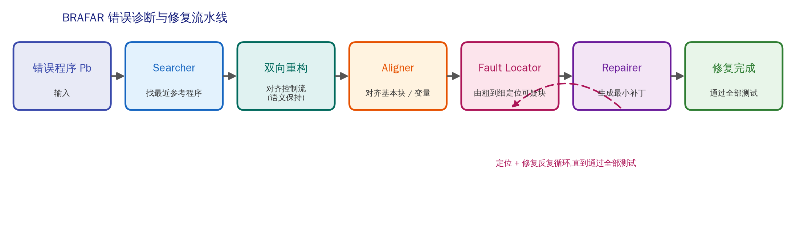

# BRAFAR 技术诊断过程整理

> 第二轮任务(房年朗负责部分之一)
> 目的:把 BRAFAR 论文里"系统如何一步步诊断一个错误程序"讲清楚,作为我们
> "画像 → 个性化反馈"里【诊断层】的技术参照。区别于《BRAFAR论文对本项目的用处》
> (那份讲战略价值),本文讲**技术流程本身**:每一步吃什么、吐什么、为什么。
> 整理:房年朗,2026-07-18

---

## 0. 一句话定位

BRAFAR 解决的是:给定**一个错误学生程序 + 一批正确参考程序 + 一组测试用例**,
自动产出一个**最小的、保留学生思路的修复**。它不是"重写一份正确答案",而是
"找出学生错在哪、只改那一处"。这条"先诊断、再最小干预"的思路,正是我们反馈
系统诊断层要复用的。

整体管线(论文 Figure 2):



错误程序 Pb → **Searcher**(找最近参考)→ **双向重构**(对齐控制流,语义保持)
→ **Aligner**(对齐块/变量)→ **Fault Locator**(由粗到细定位)→ **Repairer**
(最小补丁)→ 修复完成;其中"定位 + 修复"两步反复循环,直到通过全部测试。

---

## 1. Searcher:找一个"最像"的正确程序做参照

- **输入**:错误程序 Pb、正确程序集 C。
- **做什么**:从 C 中挑出与 Pb 最接近的一份 Pc 当"修复参照"。分两步:先按
  控制流结构(CFS)做精确匹配,匹配不上就按控制流序列编辑距离取前 k=10 个,
  再在这 k 个里按 token 级编辑距离选最接近的一个。
- **输出**:一份参照正确程序 Pc。
- **为什么**:不凭空生成正确答案,而是"借"一份和学生写法最接近的正确程序——
  这样后续修改才可能小、才可能贴合学生原本的思路。
- **对我们的启示**:反馈要有"参照系"。学生代码不是孤立评判的,而是和"一个他
  本可以写成的正确版本"对比着看,差异即反馈的落点。

## 2. 双向重构(核心创新):把两份程序的控制流对齐,但不改语义

- **输入**:Pb 和 Pc(两者控制流结构可能不同,比如一个用 for、一个用 while)。
- **做什么**:对**两个方向**都施加"语义保持"的重构操作,把两份程序的控制流
  结构对齐。允许的操作只有三类(论文 Figure 5):引入空的控制流节点、交换
  if 的两个分支(条件取反)、加恒真/恒假的守卫。这些操作**不改变程序做什么**,
  只改变它"长什么样"。
- **输出**:结构已对齐的 Pb' 和 Pc'。
- **为什么**:老方法(Refactory)靠随机的"结构变异"去凑对齐,常常把学生程序
  的语义改坏,导致后面要做一堆本不必要的修复。BRAFAR 用"双向 + 语义保持"避免
  了这个坑——这是它比前人修复更小、更准的关键。
- **对我们的启示**:在给反馈前先做"对齐",能把"学生和标准答案的真实差异"和
  "只是写法不同"区分开。写法不同不该报错,真实差异才值得提示。

## 3. Aligner:对齐基本块与变量

- **输入**:结构已对齐的 Pb' 和 Pc'。
- **做什么**:(a) 块对齐——因为控制流已一致,可在两程序间建立基本块的一一对应;
  (b) 变量对齐——用"增强的定义/使用分析(EDUA)"把 Pb 的变量映射到 Pc 的变量
  (比如学生的 e 对应参考的 seq[i]),多轮从严到宽匹配,减少错配。
- **输出**:块映射 + 变量映射。
- **为什么**:只有块和变量都对齐了,才能逐块比较"这一块学生写得对不对"、
  才能在生成补丁时把参考代码里的变量名替换成学生自己的变量名(反馈才自然)。
- **对我们的启示**:个性化反馈要"说学生的语言"——用他自己的变量名、他自己的
  结构来讲,而不是硬塞一段风格迥异的标准代码。

## 4. Fault Locator:由粗到细,定位真正可疑的块

- **输入**:对齐后的两程序 + 测试用例 T。
- **做什么**:给每个基本块推断一份"规格(specification)"——即在测试用例下,
  这个块的输入状态应产生什么输出状态。拿学生程序每个块的实际行为和这份规格
  比对,不符的才算"可疑"。定位是**由粗到细**的:先怀疑大的复合块,不行再往下
  收缩到基本块、到具体语句。
- **输出**:一个(或几个)可疑基本块。
- **为什么**:不是"哪里和标准答案不一样就报哪里"(那会报一堆无关差异),而是
  "哪里导致了测试失败才报哪里"。这让修复聚焦、补丁最小。
- **对我们的启示**:★**这一步对我们最关键**。"由粗到细"的定位深度天然是一把
  分级的尺子:
  - 只告诉学生"问题在这个大块里" = 粗粒度 = 给新手的弱提示;
  - 指到具体基本块 = 中粒度 = 给进阶者的方向;
  - 定位到具体语句并给补丁 = 细粒度 = 给熟练者的最小修复。
  **同一套定位结果,截取不同深度,就是"同题不同答"。**

## 5. Repairer:只修那个可疑块,给最小补丁

- **输入**:可疑基本块 + 它在 Pc 里对应的正确块。
- **做什么**:两步——(a) 语句匹配:多轮(从严到宽)把学生块里的语句和正确块
  里的语句配对;(b) 补丁生成:配不上的才动手,分插入/删除/修改三种最小操作,
  并把补丁里的变量名换成学生自己的。
- **输出**:针对该块的最小补丁。
- **循环**:定位 + 修复反复进行,直到修复后的程序通过全部测试用例。
- **为什么**:保证"改得尽量少",既容易让学生理解,也不破坏他其余正确的部分。
- **对我们的启示**:反馈的"代码供给"应该是最小必要的——能给片段就不给整段,
  能给提示就不给代码。给多少,由画像(尤其 D 维调试能力)决定。

---

## 6. 一步一步看一个真实例子(取自我们的错误案例 case1)

学生程序(Refactory question_1 / wrong_1_001,已实测复现失败):
```python
def search(x, seq):
    for i, e in enumerate(seq):
        if x < e:            # <-- 这里
            return i
    return len(seq)
```
参考正确程序:
```python
def search(x, seq):
    for i in range(len(seq)):
        if x <= seq[i]:
            return i
    return len(seq)
```

BRAFAR 走一遍(我们已用 BRAFAR 工具实测,输出与下述一致):
1. **Searcher**:选到上面这份结构几乎相同的参考程序。
2. **双向重构**:一个用 `enumerate` 一个用 `range(len())`,控制流本质一致,
   稍作对齐即可,无需破坏语义。
3. **Aligner**:变量映射 `e ↔ seq[i]`。
4. **Fault Locator**:测试 `search(3,(1,3,5))` 期望返回 1,学生程序返回 2
   (因为 3<3 为假,跳过了)。定位到 `if x < e:` 这一句可疑。
5. **Repairer**:最小补丁——`<` 改成 `<=`。改完通过全部测试。

**BRAFAR 的最终产物**:出错行(第 3 行)+ 最小修复(`<`→`<=`)+ 修复后程序。
这三样,正是我们反馈系统【诊断层】要交给【画像层】去"因人而异地讲"的原料。

---

## 7. 诊断层 → 画像层的接口(本项目怎么接)

BRAFAR(或第一版里我们预先整理好的诊断信息)对每个错误产出一个**诊断包**:

| 字段 | 含义 | 在分级反馈里的用途 |
|---|---|---|
| error_class | 错误类别 | 给新手点明"错在哪一类" |
| fault_line | 出错行 | 所有档位都用来指位置(深浅不同) |
| diagnosis | 详细诊断 | 进阶档讲清"为什么错" |
| min_fix_hint | 最小修复提示 | 进阶档给方向、熟练档给补丁 |
| concept_hint | 相关概念 | 新手档补基础概念 |
| patched | 修复后代码 | 熟练档直接给最小补丁 |

**关键点**:诊断包对所有学习者是**同一份**(错误是客观的);真正"因人而异"的
是画像层决定**从这份诊断包里取哪些字段、讲多深、给不给代码**。这就把"改什么"
(BRAFAR 客观诊断)和"怎么对这个人讲"(画像驱动)干净地分开了——也正是我们
项目相对 BRAFAR 的增量所在。

> 落地见 `demo/` 目录:`cases/cases.py` 里每个错误案例都带上了这个诊断包,
> `demo/demo.py` 把诊断包交给画像层生成分级反馈。
